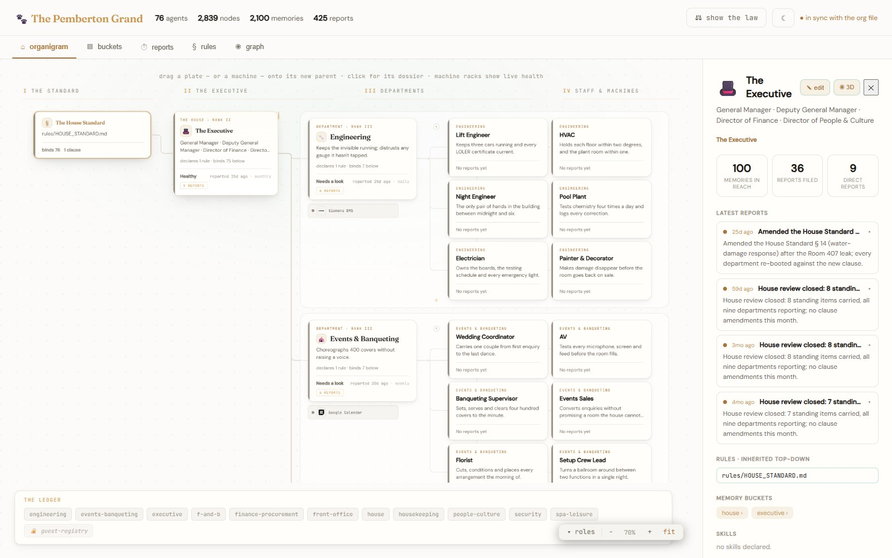
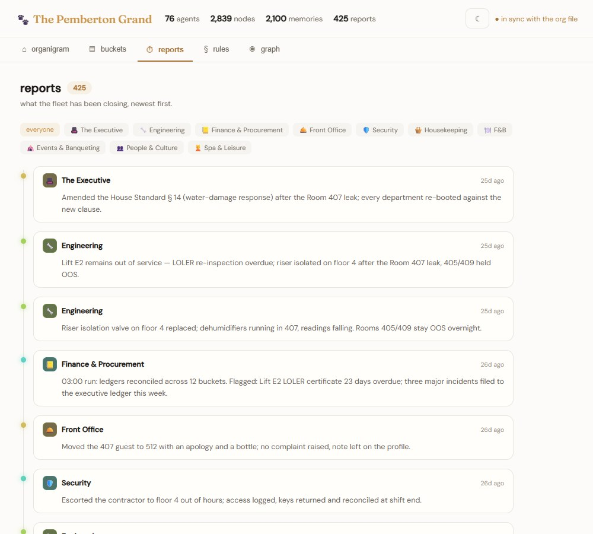
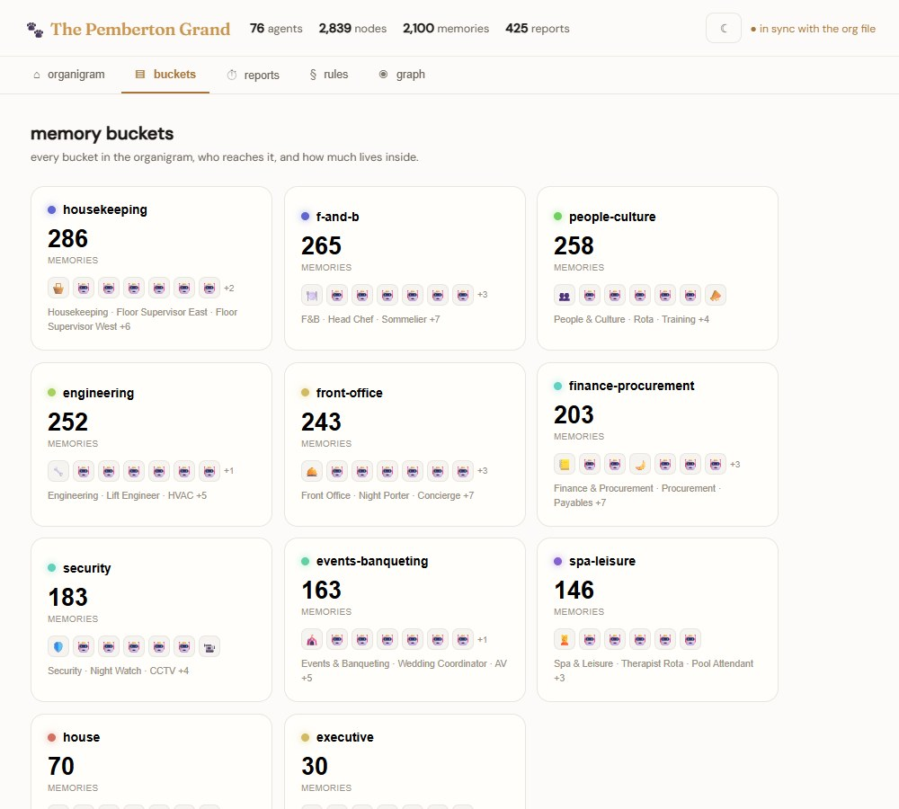

# 🐾 Booboo — the unified operational brain

[](https://www.npmjs.com/package/@booboo-brain/cli)
[](https://www.npmjs.com/package/@booboo-brain/spec)
[](#license)
[](#connect-it-to-claude--cursor-mcp)
[](#quickstart)

> Turn any AI system's data into one living, rooted 3D brain — **structure + knowledge + memory + agents + automations** fused into a single graph. Query it by **REST or MCP**, view it in your **browser or as a desktop wallpaper**, and **boot your agents from it in one call**.

**See it before you install it → [booboo.fractionalhq.uk](https://booboo.fractionalhq.uk)** · a live brain in your browser, no signup, nothing to clone.

Named after a dachshund who never forgets where the treats are buried. Fitting, because Booboo is about exactly that: **memory and recall** — seeing the whole system at once, fetching what's buried, never losing the thread.


*Unretouched: `booboo view --demo --nodes 50000` — 50k nodes, 4 layers, live in a browser tab, zero console errors. Try it yourself in one command.*

Most tools show you *one* slice: a knowledge graph, an agent flow chart, a memory store, a trace viewer. Booboo fuses all of them into **one graph rooted at a single point**, so you can see — and query — how the whole system actually hangs together.

> **Status:** alpha — eight packages published: [`@booboo-brain/spec`](https://www.npmjs.com/package/@booboo-brain/spec) (the contract), [`@booboo-brain/build`](https://www.npmjs.com/package/@booboo-brain/build) (config-driven postgres/json adapters), [`@booboo-brain/serve`](https://www.npmjs.com/package/@booboo-brain/serve) (REST + MCP query layer), [`@booboo-brain/viewer`](https://www.npmjs.com/package/@booboo-brain/viewer) (million-node 3D render), [`@booboo-brain/panel`](https://www.npmjs.com/package/@booboo-brain/panel) (the organigram), [`@booboo-brain/vault`](https://www.npmjs.com/package/@booboo-brain/vault) (wiki-linked markdown export), [`@booboo-brain/cli`](https://www.npmjs.com/package/@booboo-brain/cli) (the unified `booboo` command), and [`create-booboo`](https://www.npmjs.com/package/create-booboo) (project scaffolder). Per-package semver — see each `package.json`. MIT.

---

## The one idea

Booboo is a tiny **JSON spec** at the center, with **adapters** that feed it and **consumers** that render/serve/query it:

```
  your data ──▶  ADAPTERS  ──▶  GRAPH JSON ──▶  CONSUMERS
  (postgres,     (config-       (the spec,       (3D viewer ·
   json, neo4j,   driven,        ~1 KB            REST API ·
   mcp, …)        ~50 lines)     contract)        MCP server · wallpaper)
```

Emit the JSON → get the viewer, the API, and the MCP server **for free**. Weird data → a ~50-line adapter, not a fork. See `SPEC.md`.

## Quickstart

**One command. No database, no config, no signup.** A synthetic brain, running on your machine:

```bash
npx @booboo-brain/cli view --demo --nodes 1000000
```

That's the headline flex: **a million nodes at 60fps in a browser tab.** Drop the count to `--nodes 50000` on a modest laptop. See [SCALE.md](SCALE.md) for how it holds up (one draw call over a single point cloud with a custom shader, plus tier-LOD on labels).

If it holds up on your machine, [leave a star](https://github.com/jessymariau/booboo). There's no marketing behind this repo; stars are how the next builder finds it.

**Then point it at your own stack:**

```bash
# scaffold a project (json starter + postgres upgrade path)
npx create-booboo my-brain
cd my-brain
npm install
npm run build                    # booboo.config.yaml → brain.json (the snapshot)
npm run serve                    # REST API on http://localhost:8787
npm run mcp                      # MCP over stdio — point Claude / Cursor / Claude Code at it
```

Edit `booboo.config.yaml` to point at your own Postgres/Supabase (a commented example ships in the scaffold). Full reference: [docs/CONFIG.md](docs/CONFIG.md) · stuck? [docs/TROUBLESHOOTING.md](docs/TROUBLESHOOTING.md).

> **Roadmap:** a single all-in-one command bundling build + REST + MCP + the 3D viewer together, and an interactive scaffold wizard — tracked in [LAUNCH_CHECKLIST.md](LAUNCH_CHECKLIST.md).

## What works today

```bash
booboo build --config booboo.config.yaml    # any postgres/json → one graph snapshot (privacy walls + parent spines)
booboo serve --snapshot my.booboo.json --port 8787   # REST: /graph /stats /search /nodes/:id /neighbors/:id /path/:a/:b
booboo mcp   --snapshot my.booboo.json --org org.booboo.json  # MCP over stdio (+ booboo_boot: agents boot FROM the org)
booboo view  --snapshot my.booboo.json               # 3D viewer in your browser — no monorepo, no build step
booboo panel --org org.booboo.json --snapshot my.booboo.json  # THE ORGANIGRAM — see below
booboo vault --snapshot my.booboo.json --org org.booboo.json --out vault  # the brain as a markdown vault — see below
```

`booboo view` serves the `@booboo-brain/viewer` 3D renderer as a standalone app — any snapshot (or `?n=1000000` synthetic) in your browser, no monorepo. The build engine was
proven on a real **4,469-node production brain** assembled straight from Supabase by config alone —
privacy-walled, validated, served. See each package's README for the details.

### Connect it to Claude / Cursor (MCP)

`booboo mcp` speaks MCP over stdio. Point any MCP client at it — no server to host, it runs on demand:

```jsonc
// Claude Desktop: claude_desktop_config.json · Cursor: .cursor/mcp.json · Claude Code: .mcp.json
{
  "mcpServers": {
    "booboo": {
      "command": "npx",
      "args": ["-y", "@booboo-brain/cli", "mcp",
               "--snapshot", "my.booboo.json", "--org", "org.booboo.json"]
    }
  }
}
```

Your agent can now query the whole system — `search`, `neighbors`, `path`, `stats` — `booboo_boot('<agent-id>')` returns an agent's rules, memory reach, and reports so it **boots from the org**, and `booboo_remember` / `booboo_report` let it **write back** durable memories and reports that persist across rebuilds (the live memory system). Point `--snapshot`/`--org` at absolute paths if the client's working directory differs.

## Tools

| Tool | What it does |
|---|---|
| `booboo_stats` | Node/link counts for the whole graph, broken down by layer. |
| `booboo_count` | Counts alone, without pulling the payload — use when sizing a query. |
| `booboo_search` | Search nodes by label or id (ranked: exact > prefix > substring). Use this first to find a node's id. |
| `booboo_node` | Fetch a single node (all fields + data) by its exact id. |
| `booboo_neighbors` | The neighbourhood around a node: connected nodes + links out to `depth` hops. |
| `booboo_path` | Shortest path (chain of nodes) between two node ids; null if unreachable. |
| `booboo_boot` *(with `--org`)* | An agent's boot slice of the organigram: identity, authority chain, inherited rules, bucket access, skills, children. Call this first, every session. |
| `booboo_org` *(with `--org`)* | The full organigram: every agent, the hierarchy, buckets and rule refs. |
| `booboo_remember` | **Write** a durable memory — one atomic fact, tied to an agent. Appended to the journal beside the snapshot; queryable the same session, survives every rebuild. |
| `booboo_report` | **Write** a report — what an agent just closed. Lands on the panel's Reports timeline. |

> `booboo_remember` / `booboo_report` are on by default — the live half of the memory system. Pass `--no-write` (or `BOOBOO_READONLY=1`) for a read-only server (public/locked-down deployments); it still *reads* the journal but refuses writes.

## The Organigram — run your agents like a company



`booboo panel` opens your agent fleet as a **real org chart** — and the chart is not a diagram, it's the **authority**. Every agent is a card: its rules, skills, memory-bucket access, and latest reports. **Drag an agent under a new parent, hit apply, and the org file changes** — versioned in git, validated before every write (a cycle can never land). Agents that boot with `booboo_boot` obey the new shape on their next session. Reorganize your company at breakfast; the whole fleet knows by the first coffee.

| the portfolio timeline | memory, bucket by bucket |
|---|---|
|  |  |

Five tabs over one org file + one snapshot: **organigram** (drag-drop hierarchy) · **buckets** (who remembers what) · **reports** (what the fleet closed, newest first) · **rules** (who declares, who inherits) · **graph** (the 3D brain, embedded). Rules inherit top-down — declare once at a branch, everyone beneath is bound; every dossier shows the inherited stack in boot order.

Reports and buckets fill two ways: **live**, when an agent calls `booboo_remember` / `booboo_report` (durable journal writes, no rebuild), or **in bulk** from your own tables via config — see [docs/CONFIG.md § Wiring fleet reports & memory](docs/CONFIG.md#wiring-fleet-reports--memory-the-panels-reportsbuckets-tabs).

## The vault — your brain as plain markdown (Obsidian-ready)

`booboo vault` emits the same snapshot as a **wiki-linked markdown vault**: one page per
node with frontmatter and its links, index pages per layer and cluster, an agent dossier
per org member (chain of command, inherited rules, buckets, machines, contract). Open the
folder as an Obsidian vault and you have the "LLM second brain" pattern — except generated
from your *real* system instead of hand-fed notes. Plain files are the ultimate portability:
any human can read them, any agent from any provider can too. Emit it nightly and the vault
doubles as your insurance copy.

Author links yourself: put `[[node-id]]` (or `[[exact label]]`) refs inside a note's text and
set `wikilinks: true` in the config — the builder turns them into first-class `authored` edges
that outrank harvested relations, in the graph, the API, the 3D view and the vault. Every build
also prints an **ingestion-quality line** (`authored · orphans · dump-suspects`) so curation is
a number, not a vibe.

## Your agent knows what to do — the contract ships with the scaffold

`npx create-booboo` scaffolds **AGENTS.md** (imported by **CLAUDE.md**) into the project: the
operating doctrine any AI agent working that folder reads automatically — boot from the org,
one atomic fact per note, author your `[[links]]`, corrections replace, respect the walls,
watch the quality gate, close honestly. A fresh install leaves your agent already fluent in
the brain's conventions; edit the file as your own rules evolve — it is your system's
constitution, versioned next to the org.

## Why it's different

The closest things on GitHub each do *one* layer — good tools, all of them, for their slice:

| | Whole-system view | REST API | MCP (agents query it) | 3D at 1M nodes | Privacy walls |
|---|:---:|:---:|:---:|:---:|:---:|
| **Booboo** | ✅ | ✅ | ✅ | ✅ | ✅ |
| Graph viewers (`3d-force-graph`) | render only | — | — | ✅ | — |
| Note graphs (Obsidian, Logseq) | your notes, not your system (booboo *emits* an Obsidian vault: `booboo vault`) | — | plugins | — | — |
| Agent frameworks (LangGraph, traces) | flows & runs | ✅ | partial | — | — |
| Memory stores (Graphiti, Cognee) | memory only | ✅ | ✅ | — | — |

None fuse **wiring + knowledge + episodic memory + agents + crons** into one rooted, live, **bootable** brain that's simultaneously a view, a wallpaper, an API, and an MCP source. That operational fusion is the novel part.

## Key in hand (optional — everything above stays free)

Every feature is MIT and always will be. If you'd rather not do the setup yourself,
[Fractional HQ](https://fractionalhq.uk/services) maps *your* stack: custom adapters,
hosted snapshot, refresh pipeline. Same repo, same config schema, never a fork, never a gate.

## License

MIT — built to be forked, adapted, and shipped. By [Fractional HQ](https://fractionalhq.uk).
